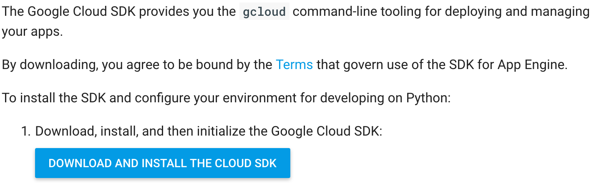
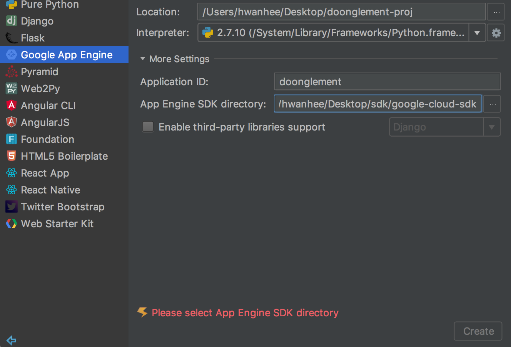
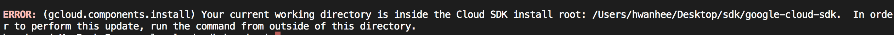
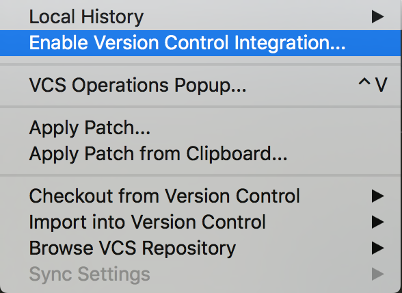
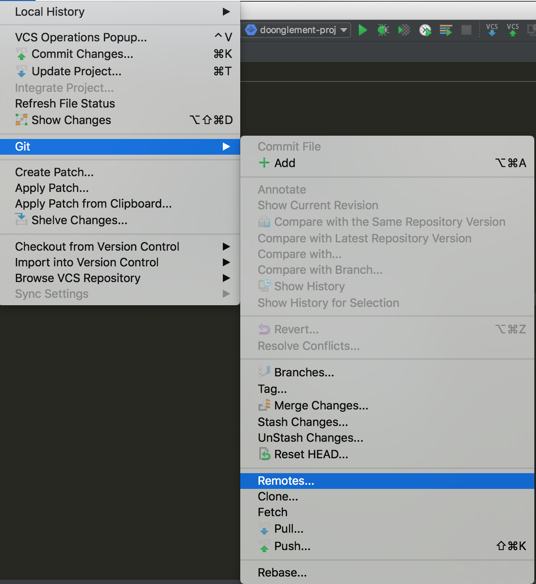

## Python with App Engine

## Index  
1. Django or Flask
2. Create Empty Project
3. Deploy Empty Project
4. Get data from Cloud SQL 
5. Create profile approval page

---  

## 1. Django or Flask  
* What is that?  
  - 웹 어플리케이션 프레임워크  
  - 필요할 거라고 생각한다. (직감)

## 2. Create Empty Project
  - 우선 프로젝트를 만들기 위해 필요한 것은 앱 엔진 SDK이다.  
  - SDK 다운로드는 앱 엔진 공식 문서를 참고하면 될것이다.  
  - Python 2.7을 사용할 것이다.  
  - 개발 환경 : Mac OS, PyCharm  
  
### 2-1. 앱 엔진 환경 선택
  - Flexible 
  - Standard
  - 문서를 읽어보니 나 같은 뉴비는 Standard를 사용하고, 더 강력한 서비스를 제공하기 위해서는 추후에 Flexible 환경을 선택하면 될것이다.  
  - Standard -> Flexible Migration Guide를 제공하므로 Standard를 선택한다.  
  - 라고 생각했는데, 무료 평가판 사용 중이므로 Flexible Environment를 선택한다.  
  
### 2-2. SDK 설치  

  

해당 버튼을 눌러서 다운로드를 진행하자.  

  
후.. 어떻게 해야하지???  
SDK 디렉토리를 설정해줬더니 저 모양이다. 뭔가가 잘못되었음이 틀림없다.  
하지만 구글신은 정답을 알고계신다.  (https://stackoverflow.com/questions/40667575/what-is-google-app-engine-sdk-directory-in-windows)  
  
위 링크대로 했더니 이런 에러가 난다. 당황하지 않고 내용을 잘 읽어보길 바란다.  
디렉토리 밖에서 하라는 소리다.  
성공적으로 마무리가 됬으면 SDK 디렉토리를 platform/google_appengine으로 설정하면 끝난다.  

## 3. Deploy Empty Project  

우리는 물론 Django를 나중에야 쓰겠지만, 아직은 필요 없으므로 Django 없는 빈 AppEngine 프로젝트를 만든다.  

Tools > Google App Engine 을 눌러 배포를 해보자.  
성공적으로 배포가 되었는지 확인하기 위해 Hello World 같이 식상한 문구 대신 Helllo World 문구를 사용한다.  
아무 문제 없이 배포가 된다.  
이 과정에서 문제가 생겼다면, 심심한 위로의 말씀을 전합니다.  

### 3-1. Git  
집에서도 개발하고 싶고, 회사에서도 개발하고 싶다.  
정답은 Version Control, 그 중에서 가장 힙한 git을 쓰도록 하자.  
나 같이 커피 값엔 관대하면서 개발 관련 비용에는 인색한 사람은 bitbucket을 사용하도록 하자. (private repository 지원)  

  
  

이렇게 작업이 술술 진행될 때는 의심을 해야한다.  
더 생각할 거리는 없는지에 대해서!!  
하지만, 겪어보지 않고서는 모르기 때문에 그냥 remote 주소 추가 작업을 진행한다.  
집에서 push 해보고 회사가서 후회하도록 하자.  

## 4. Get data from Cloud SQL  
시도해보자.  
mysql-connector를 설치해야 하는데, MySQLdb module이 해당 모듈이다.  
pip install MySQLdb ...  
Fail ...  
뜻대로 되지 않아 해당 링크를 참고해봤다.  
https://stackoverflow.com/questions/25865270/how-to-install-python-mysqldb-module-using-pip  
https://stackoverflow.com/questions/17599830/installing-mysql-python-on-mac  
... 해도 안된다.  

https://github.com/PyMySQL/PyMySQL를 대신 쓰도록 하자. (PyMySQL Module)  

...  
MySQL-python을 인터프리터 설정에서 추가했더니, mysqldb 모듈이 추가되었다.  
결론 : 인터프리터에서 MySQLdb 또는 MySQL-python을 설치하세요.  
  
그런데 안되는 이유는 따로 있었다.  
내 목표는 Google App Engine과 Google Cloud SQL을 함께 사용하는 것이다.  
앱엔진 서버와 sql서버가 같은 지역에 위치해야 하는데, 그동안 내가 만든 앱엔진 서버는 asia에 있었다. (sql은 us)  
  
---  
때문에 이번에 새로 만들 앱엔진 프로젝트는 us-central에 위치하게끔 했다.  
이 간단한 것을 왜 생각 못했을까...?  
Cloud SQL에 앱엔진 인스턴스 추가에 성공하였다.  
이제 본격적으로 sql에 접근해보자.  
---   

