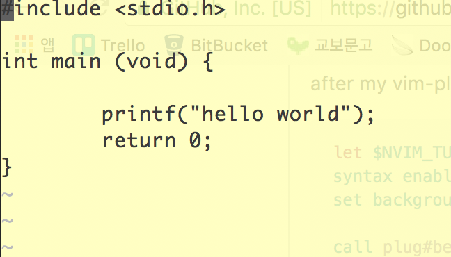

## custom colorscheme 적용하기

### 현재 저는 맥을 사용하고 있습니다.

1. 우선 사용하고 싶은 colorscheme을 찾아봅니다.
      - 참고로 github에 유용한 스킴이 많습니다.
2. 기본 설정을 시작해보죠.
      - colorscheme을 ~/.vim/colors 에 저장하시죠
      - 만약 해당 디렉토리가 없다면 만드시면 됩니다. (runtimepath에 ~/.vim이 포함되어 있기 때문에 관리하기 편하게 해당 디렉토리를 만들어서 관리해줍시다.)
      - runtimepath가 궁금하다면 vim을 키셔서 :set runtimepath?를 해보세요
      - 받아놓은 colorscheme을 해당 디렉토리로 옮겨줍니다.
      - vim을 켜서 :colorscheme 이름 을 입력하시면 됩니다.
           
           * 예를 들면, hwan.vim이라는 colorscheme을 받은 경우에 :colorscheme hwan 하시면 됩니다.
3. 아직은 부족해...
      - 하지만, vim을 종료하면 설정해두었던 colorscheme이 초기화됩니다.
      - 제가 원하는건 vim을 실행할 때 마다 제가 원하는 colorscheme을 적용하는 것입니다.
      - 아니 ... 그 이전에!
      - 인터넷에서 본 colorscheme이랑 제가 적용한 colorscheme이 다릅니다.
        
        분명 적용은 된 것 같은데 색상도 다르고 이것 저것 다 다르죠.
      - 관련해서는 나중에 !! TODO:
      
4. 귀찮다... 플러그인을 쓰자
      - Vim의 플러그인 관리자 Vundle을 설치합니다. (git clone https://github.com/gmarik/Vundle.vim.git ~/.vim/bundle/Vundle)
      - PluginInstall
      - 그러면 Vundle 프로그램은 ~/.vim/bundle에 설치되고 Vundle을 이용해서 받은 플러그인은  ~/.vim/bundle에 설치됩니다.       
      - 자 그렇다면, Vundle을 이용해서 colorscheme을 받으면 해당 scheme이 ~/.vim/bundle에 설치 됬습니다.
      - ~/.vimrc 에서 colorscheme을 적용하려고 하면 "cannot find color scheme ' ~~~ ' " 라고 뜹니다.
          
          + 왜 그럴까요???
          + cp ~/.vim/bundle/vim-colors-solarized/colors/solarized.vim ~/.vim/colors/ 와 같은 작업을 해줍시다. (예시)
          + 했는데 ... 화면이 아래와 같습니다.
          
          
          
          
          망했네요. 당황하지 않고 해결책을 찾아봅시다.

    
---
[링크]
http://blog.freezner.com/archives/1087

https://stackoverflow.com/questions/9239107/where-is-vim-folder-in-mac-os-and-how-to-install-themes-in-gvim

https://github.com/morhetz/gruvbox/wiki/Installation

https://bluesh55.github.io/2016/10/09/vim-ide/
